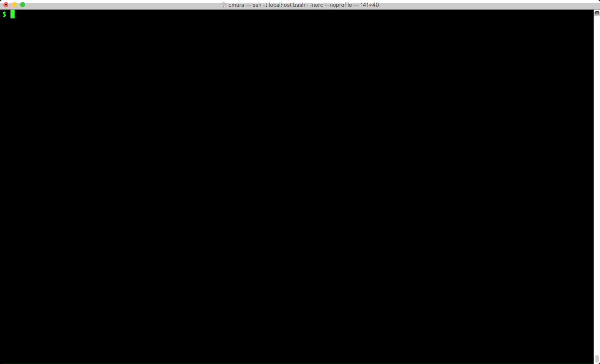

# kubectl-pecologs
[](LICENSE)

'kubectl logs' for multiple pods/containers + peco.



This is implemnted as [`kubectl plugin`](https://kubernetes.io/docs/tasks/extend-kubectl/kubectl-plugins/).

# Requirements
- [kubectl v1.8.0](https://github.com/kubernetes/kubernetes)
  - `kubectl` is shipped with [kubernetes](https://github.com/kubernetes/kubernetes)

# Installation

```
curl -sSL https://raw.githubusercontent.com/everpeace/kubectl-pecologs/master/install.sh | sh -s
```

# How to

```
$ kubectl plugin pecologs -h
output container logs of containers specifying by query and  peco.

Examples:
  pecologs --since=1s query

Options:
      --all-namespaces='false': list pods and containers in all namespaces
      --dry-run='false': dry run mode. just print out commands to be executed.
  -i, --interactive='true': if you set false, you can skip peco.
      --since='1s': Only return logs newer than a relative duration like 5s, 2m, or 3h. Defaults to all.

Usage:
  kubectl plugin pecologs [options]

Use "kubectl options" for a list of global command-line options (applies to all commands).
```
